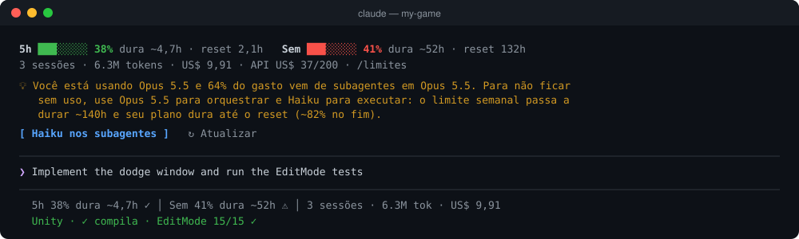
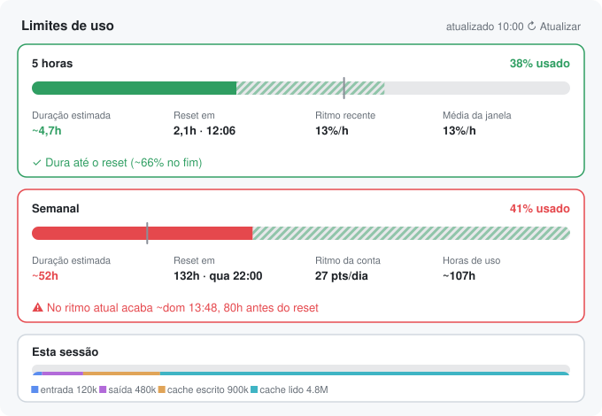

<div align="center">

# claude-mods

**Mods para o Claude Code: veja quanto tempo o seu plano dura, passe o trabalho de uma máquina para outra e dê ao Claude olhos para o Unity e o Blender.**

[](LICENSE)
[](https://code.claude.com/docs)


[English](README.md) · [Português](README.pt-BR.md)



</div>

---

Mods do Claude Code são plugins de **function hooks**: TypeScript que roda dentro do Claude Code e pode desenhar painéis e faixas, criar comandos, observar as ferramentas e devolver contexto ao modelo. Este repositório é um marketplace com quatro deles, feitos para o uso diário num plano Max e em projetos de jogo.

| Mod | O que entrega |
|---|---|
| [**usage-limits**](#usage-limits) | Os limites de 5h e semanal com **quanto tempo duram** no ritmo atual, tokens e custo de todas as sessões abertas, gasto por projeto, acompanhamento dos créditos de API e uma recomendação de modelo para você não ficar sem uso antes do reset. |
| [**fluxo**](#fluxo) | `/handoff` grava onde você parou para a próxima sessão, em outra máquina, continuar de lá; e som e notificação quando um turno longo termina. |
| [**unity-tools**](#unity-tools) | Erros de compilação entregues ao Claude segundos depois de ele editar um `.cs`, testes EditMode/PlayMode que ele pode rodar sozinho, painel de build do servidor dedicado e guardas que o mantêm longe de `Library/`, cenas e `.meta`. |
| [**blender-preview**](#blender-preview) | Miniatura da cena do Blender com orçamento de triângulos, ossos e texturas, e conferência de cada `.glb` que o Claude exporta. |

## Instalar

Precisa de um Claude Code recente (testado da 2.1.286 à 2.1.295). Num terminal, abra o `claude` e instale os mods que quiser:

```
/plugin install usage-limits --marketplace kevinmedeiros/claude-mods
/plugin install fluxo --marketplace kevinmedeiros/claude-mods
/plugin install unity-tools --marketplace kevinmedeiros/claude-mods
/plugin install blender-preview --marketplace kevinmedeiros/claude-mods
```

Na primeira vez, responda `y` para adicionar o marketplace e escolha o escopo **user**. A partir daí os mods rodam em todas as sessões do Claude Code da máquina: terminal, aba Code do Claude Desktop e extensões de IDE. Reabra as sessões que já estavam abertas.

Atualize com `/plugin update <mod>`; ajuste as opções em `/plugin` → o mod → configurar.

---

## usage-limits



Os percentuais vêm dos próprios cabeçalhos de limite da Anthropic, então valem para **a conta inteira**: todas as sessões, todas as máquinas e o claude.ai. Em cima deles o mod responde o que a página de uso não responde: *isso dura até o reset?*

- **Linha de status e faixa acima do prompt** com o % de cada limite, quantas horas ele dura no ritmo atual, tempo até o reset, e tokens e custo de todas as sessões abertas.
- **Painel `/limites`** com barras de uso, projeção até o reset e marcador de ritmo uniforme. Mostra também o ritmo do 5h, o ritmo semanal em pontos por dia e quantas horas de trabalho restam no ritmo da última hora.
- **Todas as sessões abertas** na máquina, com projeto, modelo, tokens, custo e fatia do total, mais o total do dia.
- **Gasto por projeto** em cada janela, para saber qual projeto está queimando a semana.
- **Recomendação de modelo.** Quando o ritmo não chega ao reset, sugere a troca menos disruptiva, como *"use Opus para orquestrar e Haiku para executar"*, e mostra quanto o limite passaria a durar.
- **Modo economia** (`/economia on`). O fio principal mantém o modelo e os subagentes novos rodam em Claude Haiku 5.5.
- **Créditos de API.** Opcional, com uma Admin API key do Console: gasto do crédito mensal por modelo, ritmo por dia e quando ele acaba.
- **↻ Atualizar** para pegar a leitura mais nova que qualquer sessão da máquina recebeu.
- **Avisos** em 80%, em 95%, ao esgotar e quando a projeção indica que o limite acaba antes do reset.

<br clear="right">

| Opção | Padrão | |
|---|---|---|
| `adminApiKey` | — | Chave `sk-ant-admin…` da organização do Console que recebe os créditos de API do plano. Guardada em armazenamento seguro. |
| `apiMonthlyCredit` | `200` | Max 5x: 100 · Max 20x: 200 |
| `apiCycleDay` | `1` | Dia do mês em que o crédito renova |

<details>
<summary><b>Como a projeção funciona</b></summary>

- **Janela de 5h:** o ritmo da última hora, ou a média da janela quando ela acabou de começar. Horas restantes = (100 − usado) ÷ ritmo.
- **Janela semanal:** os pontos que a conta gastou nas últimas 24 horas, nunca com menos de um dia de histórico, para uma primeira manhã intensa não virar o ritmo da semana inteira. Isso inclui outras máquinas e a madrugada.
- **Horas de trabalho** (semanal, extra): o mod mede quantos pontos semanais cada ponto do 5h custa, dentro de uma mesma janela de 5h, e multiplica pelo ritmo do 5h. Reage em minutos a uma troca de modelo.
- **Cenários de modelo:** o gasto das últimas três horas ativas é precificado por modelo pela tabela da API, e cada cenário o reprecifica com um modelo mais barato. A assinatura pode pesar os modelos de outro jeito, então trate os números como estimativa.
- **Atualidade:** uma sessão só fica sabendo do % da conta pelas próprias respostas da API. As sessões da mesma máquina compartilham a leitura mais nova, e a faixa avisa *"leitura há 2h"* quando passa de 10 minutos.

</details>

## fluxo

Continue em outra máquina de onde parou.

- **`/handoff [observação]`** faz o Claude Haiku 5.5 resumir a sessão (onde parou, o que foi feito, próximos passos, cuidados) e grava em `.claude/handoff.md`, com os arquivos alterados e o estado do git.
- **Handoff automático** (desligado por padrão). Com `autoHandoff` ligado, todo turno que edita arquivos atualiza a lista, então fica registro mesmo se a sessão cair.
- **Na outra máquina**, a próxima sessão no projeto mostra *"↪ Handoff de MacBook (há 3h): …"* acima do prompt, com os botões **Continuar daqui**, **Ver** e **Dispensar**.
- **Aviso de turno longo:** notificação e, no macOS, um som quando um turno passa de 3 minutos. Pode também falar em voz alta.

O arquivo de handoff viaja junto com o projeto, por git ou por pasta sincronizada. Se preferir deixá-lo fora do git, adicione `.claude/handoff.md` ao `.gitignore` e sincronize a pasta.

| Opção | Padrão |
|---|---|
| `longTurnMinutes` | `3` |
| `sound` / `speak` | `true` / `false` |
| `autoHandoff` | `false` (ligue para atualizar o arquivo a cada turno que edita) |
| `handoffPath` | `.claude/handoff.md` |

## unity-tools

Liga em qualquer sessão cuja pasta tenha um projeto Unity. Ele procura `ProjectSettings/` acima da pasta da sessão ou até dois níveis abaixo.

- **Erros de compilação no contexto do Claude.** Depois que o Claude edita um `.cs`, o mod compila aquele assembly com `dotnet build` a partir do `.csproj` que o Unity gera, fora do projeto, em `Temp/`, em cerca de 1 segundo. Os erros voltam junto com o resultado da ferramenta. Arquivos novos que o Unity ainda não listou entram também.
- **`/testes [editmode|playmode|tudo]`** roda o Test Runner do Unity em batch e mostra o resultado no painel `/unity`, com o botão *mandar falhas pro Claude*. O próprio Claude pode chamar a ferramenta `unity_tests` para conferir as mudanças dele.
- **`/build-servidor`** gera o build do servidor dedicado Linux e mostra o log ao vivo. Avisa se faltar o módulo *Linux Dedicated Server*.
- **Guardas** recusam, com um motivo que o Claude entende:
  - editar `Library/`, `Temp/`, `Logs/` ou `UserSettings/`;
  - escrever `.unity` ou `.prefab` à mão;
  - criar ou apagar `.meta` à mão;
  - usar `UnityEngine` numa pasta de núcleo sem engine.

| Opção | Padrão | |
|---|---|---|
| `projectPath` | automático | Pasta do projeto, se a detecção falhar |
| `unityPath` | caminho do Unity Hub para a versão do projeto | |
| `coreDir` | `Assets/Scripts/Core` | Pasta sem engine; vazio desliga a guarda |
| `compileCheck` | `true` | |
| `allowSceneEdits` | `false` | |
| `serverBuildPath` | `Builds/Server/Server.x86_64` | |
| `buildMethod` | — | ex.: `MyGame.Editor.BuildServer.Build`; vazio usa `-buildLinux64Player` |

**Requisitos:**
- Unity Hub com a versão do editor do projeto.
- O .NET SDK (`dotnet`), para a checagem de compilação.
- Arquivos de projeto gerados: Preferences → External Tools → *Regenerate project files*.
- Os testes em batch precisam do editor fechado para aquele projeto.

## blender-preview

Funciona com o Blender conectado ao Claude Code por um servidor MCP do Blender.

- **Depois de cada mudança** que o Claude faz na cena pelo Blender MCP, o mod renderiza uma miniatura e mede triângulos por objeto, ossos, materiais, texturas e animações contra o seu orçamento. `/blender` abre o painel.
- **A cada export de `.glb`**, lê o arquivo e entrega ao Claude um relatório: tamanho, triângulos, skin e ossos, animações e tamanho das texturas, com aviso para o que passar do orçamento.
- **`/glb <arquivo>`** confere qualquer `.glb`.

| Opção | Padrão |
|---|---|
| `maxTriangles` | `20000` |
| `maxBones` | `100` |
| `maxTextureSize` | `2048` |
| `autoPreview` | `true` |
| `server` | `Blender` |

---

## Privacidade

Tudo fica na sua máquina.

- **Arquivos locais.** Os mods gravam em `~/.claude/usage-limits/`, no armazenamento de cada plugin e em `.claude/handoff.md` no seu projeto.
- **Requisições de rede:**
  - o `usage-limits` chama a API de custo do Console, e só se você configurar uma Admin key;
  - o `fluxo` chama o Claude Haiku 5.5 quando você roda `/handoff`;
  - nada mais sai da máquina.
- **Processos locais:** o `unity-tools` roda o `dotnet` e o editor do Unity; o `blender-preview` fala com o seu Blender local pelo MCP.

## Desenvolvimento

```
plugins/<mod>/
  .claude-plugin/plugin.json   manifesto e opções
  hooks/register.tsx           o módulo de hooks
  hooks/*.ts                   lógica pura (com testes)
  tests/*.test.ts              rodados pelo `claude plugin test`
  types/index.d.ts             o contrato de estado do mod
```

```bash
claude plugin validate plugins/usage-limits
claude plugin test plugins/usage-limits
claude --plugin-dir plugins/usage-limits
```

Com `--plugin-dir`, o mod recarrega a cada vez que você salva. Para gerar de novo as imagens deste README, rode `bun docs/generate-previews.ts`; elas são desenhadas com o próprio código dos mods. Veja o [CONTRIBUTING.md](CONTRIBUTING.md).

## Licença

[MIT](LICENSE) © Kevin Medeiros. Sem vínculo com a Anthropic.
